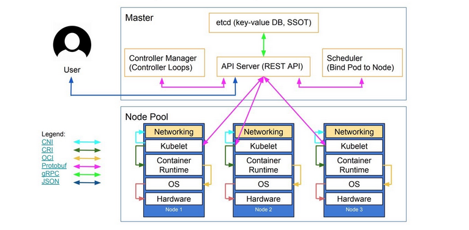

### 1. Khái niệm:

- Kubernetes (k8s) là 1 nền tảng mã nguồn mở được xây dựng bởi Google, dùng để tự động triển khai, scaling, quản lý các container. Kubernetes còn gọi là Container orchestration engine.

- Với Kubernetes có thể giúp bạn:

	* Triển khai các container trên hàng ngàn máy chủ.
	
	* Mở rộng ứng dụng hoặc thu gọn lại tùy thuộc vào nhu cầu sử dụng. Đồng thời quản lý tài nguyên và đặt ra giới hạn sử dụng tài nguyên (cpu,ram) cho từng container.
	
	* Tự động phân tải giữa các containers chạy cùng 1 ứng dụng.
	
	* Tự động kiểm tra trạng thái của container và điều phối lại hoạt động của các container khi gặp lỗi.
	
#### 2. Kiến trúc hoạt động của kubernetes:

- Kubernetes có thể triển khai trên 1 hoặc nhiều máy vật lý hoặc máy ảo để tạo thành cụm cluster. Kiến trúc logic của k8s bao gồm 2 thành phần chính, đó là: `Master node` và `Worker node`.

	* `Master node`: Đóng vai trò là thành phần Control plane, điều khiển toàn bộ các hoạt động chung và kiểm soát các container trên node worker. Các thành phần chính trên master node bao gồm: API-server, Controller-manager, Schedule, Etcd và cả Docker Engine. 

	* `Worker node`: Vai trò chính của worker node là môi trường để chạy các container mà người dùng yêu cầu, do vậy thành phần chính của worker node bao gồm: kubelet, kube-proxy và Docker.
	
- Thường khi triển khai thực tế thì số lượng `node worker` sẽ nhiều hơn số lượng `node master`. Và để đảm bảo khả năng `High Availability` thì chúng ta cần triển khai nhiều `node master`.

  

### 2.1. Các thành phần chính của Master node:

### etcd

- `Etcd` là 1 thành phần database phân tán, sử dụng ghi dữ liệu cơ chế key/value trong k8s cluster, dùng để lưu tất cả các thông tin trong cụm kubernetes cluster.

### API-server

- Là thành phần tiếp nhận yêu cầu của hệ thống K8S thông qua REST, tức là nó tiếp nhận các chỉ thị từ người dùng cho đến các services trong hệ thống Cluster thông qua API (người dùng hoặc các service khác trong cụm cluster có thể tương tác tới K8S thông qua HTTP/HTTPS.)

- API-server hoạt động trên port 6443(https) và 8080(http).

### Controller-manager

- `kube-controller-manager` là tiến trình chạy các controller để xử lý các background task của Cluster, để đảm bảo hoạt động của các tài nguyên trong cụm cluster.

- `controller-manager` sử dụng port 10252.

### Scheduler

- `kube-scheduler` có nhiệm vụ quan sát để lựa chọn ra các node mỗi khi có yêu cầu tạo `pod`. Nó sẽ lựa chọn các node sao cho phù hợp nhất dựa vào các cơ chế lập lịch mà nó có.

- `kube-scheduler` sử dụng port 10251.

### 2.2 Các thành phần chính của Worker node:

### kubelet (agent)

- `kubelet`: là thành phần chạy chính trên các node worker. Khi kube-scheduler đã xác định được 1 pod được chạy trên node nào thì nó sẽ gửi các thông tin về cấu hình (images, volume...) tới `kubelet` trên node đó. Dựa vào các thông tin nhận được thì `kubelet` sẽ thực hiện kết nối với container runtime (Docker) để tạo các container theo yêu cầu.

- `kubelet` sẽ giao tiếp với Master qua API.

### kube-proxy

- Các service chỉ hoạt động ở chế độ logic, do vậy muốn bên ngoài có thể truy cập được vào các service này thì cần có thành phần chuyển tiếp các request từ bên ngoài và bên trong.

- `kube-proxy` giúp định tuyến (route) các kết nối bên ngoài đến các Pod.

- `kube-proxy` sử dụng port 31080.

3. Tổng kết:

- Đây là những đúc kết của mình trong quá trình tìm hiểu về kiến trúc và các thành phần cơ bản trong k8s, trong phần tiếp theo mình sẽ hướng dẫn các bạn triển khai 1 cụm k8s cơ bản để sử dụng.

- Link tham khảo:

	* https://github.com/hocchudong/ghichep-kubernetes/blob/master/docs/kubernetes-5min/03.Kientrucvacacthanhphan.md

