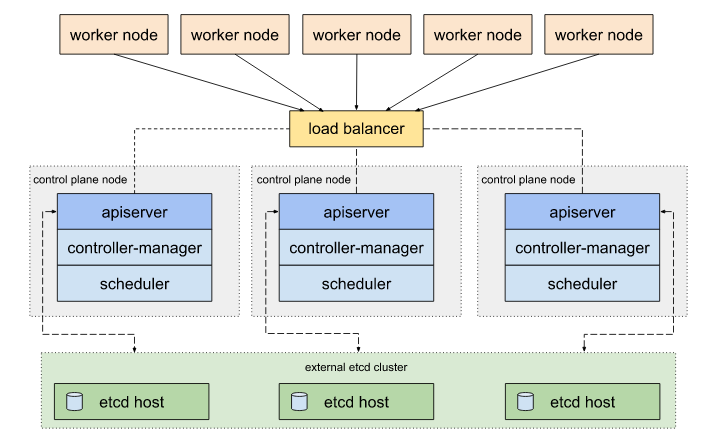

## Tài liệu hướng dẫn cài đặt, cấu hình HA k8s cluster.

### Mô hình:



- Trong mô hình này, mình sẽ hướng dẫn các bạn triển khai 1 cụm HA cluster k8s với external etcd

### Môi trường cài đặt

- 11 Ubuntu servers (18.04)

- 172.16.68.210 k8s-master-1
- 172.16.68.211 k8s-master-2
- 172.16.68.212 k8s-master-3
- 172.16.68.213 Haproxy-1
- 172.16.68.214	Haproxy-2
- VIP 172.16.68.215 (Haproxy-1 + HAproxy-2)
- 172.16.68.218 etcd1 
- 172.16.68.219 etcd2
- 172.16.68.220 etcd3
- 172.16.68.208 k8s-worker-1
- 172.16.68.209 k8s-worker-2
- 172.16.68.217 k8s-worker-3
- Root privileges

### Các bước cần thực hiện:

- Cài đặt, cấu hình Haproxy + keepalived
- Cài đặt, cấu hình HA Etcd cluster
- Cài đặt, cấu hình masters nodes k8s và workers nodes k8s

### 1. Cài đặt, cấu hình Haproxy + keepalived

- Thực hiện trên 2 node 172.16.68.213, 172.16.68.214:

- Enable VIP:

  ```
  vim /etc/sysctl.conf

  net.ipv4.ip_nonlocal_bind=1
  
  sysctl -p
  ```
  
- Install Haproxy, keepalived:

  ```
  apt install keepalived -y && apt-get install -y haproxy
  ```

- Setup keepalived configuration:

  ```
  sudo mkdir -p /etc/keepalived

  cat > /etc/keepalived/keepalived.conf <<EOF
 
  vrrp_script check_haproxy {
  script "killall -0 haproxy"
  interval 3
  weight 3
  }

  vrrp_instance LAN_133 {
  interface ens33
  virtual_router_id 133
  priority 133
  advert_int 2
  
  authentication {
    auth_type PASS
    auth_pass ahihi
  }

  track_script {
    check_haproxy
  }
 
  virtual_ipaddress {
    172.16.68.215/24
    }
  }

  EOF
  ```

- Setup Haproxy

```
cat > /etc/haproxy/haproxy.cfg <<EOF
global
	log /dev/log	local0
	log /dev/log	local1 notice
	chroot /var/lib/haproxy
	stats socket /run/haproxy/admin.sock mode 660 level admin
	stats timeout 30s
	user haproxy
	group haproxy
	daemon

	# Default SSL material locations
	ca-base /etc/ssl/certs
	crt-base /etc/ssl/private

	# Default ciphers to use on SSL-enabled listening sockets.
	# For more information, see ciphers(1SSL). This list is from:
	#  https://hynek.me/articles/hardening-your-web-servers-ssl-ciphers/
	ssl-default-bind-ciphers ECDH+AESGCM:DH+AESGCM:ECDH+AES256:DH+AES256:ECDH+AES128:DH+AES:ECDH+3DES:DH+3DES:RSA+AESGCM:RSA+AES:RSA+3DES:!aNULL:!MD5:!DSS
	ssl-default-bind-options no-sslv3

defaults
	log	global
	mode	http
	option	httplog
	option	dontlognull
        timeout connect 5000
        timeout client  50000
        timeout server  50000
	errorfile 400 /etc/haproxy/errors/400.http
	errorfile 403 /etc/haproxy/errors/403.http
	errorfile 408 /etc/haproxy/errors/408.http
	errorfile 500 /etc/haproxy/errors/500.http
	errorfile 502 /etc/haproxy/errors/502.http
	errorfile 503 /etc/haproxy/errors/503.http
	errorfile 504 /etc/haproxy/errors/504.http

frontend k8s
bind 172.16.68.215:6443
option tcplog
mode tcp
default_backend k8s-master-nodes


backend k8s-master-nodes
mode tcp
balance roundrobin
option tcp-check
server k8s-master-1 172.16.68.210:6443 check fall 3 rise 2
server k8s-master-2 172.16.68.211:6443 check fall 3 rise 2
server k8s-master-3 172.16.68.212:6443 check fall 3 rise 2

EOF
```

- Thực hiện restart haproxy và keepalived:

  ```
  systemctl restart haproxy
  systemctl restart keepalived
  ```

- Kiểm tra:

  ```
  ip a | grep ens3
  ens3: <BROADCAST,MULTICAST,UP,LOWER_UP> mtu 1500 qdisc pfifo_fast state UP group default qlen 1000
    inet 172.16.68.213/24 brd 172.16.68.255 scope global ens3
    inet 172.16.68.215/24 brd 172.16.68.255 scope global secondary ens3:1
  ```

### 2. Cài đặt, cấu hình HA Etcd cluster:

- Link: 

### 3. Cài đặt, cấu hình master node k8s và worker node k8s:  

**Thực hiện trên 3 node master và 3 node worker

- Disable swap:
  
  ```
  swapoff -a
  ```

- Install Kubeadm Packages:
  
  ```
  apt update -y && apt upgrade -y
  
  apt-get install apt-transport-https curl -y
  
  curl -s https://packages.cloud.google.com/apt/doc/apt-key.gpg | sudo apt-key add
  
  vim /etc/apt/sources.list.d/kubernetes.list
  deb http://apt.kubernetes.io/ kubernetes-xenial main
  
  apt update
  apt install -y kubeadm kubelet kubectl
  ```
  
- Install Docker:

  ```
  apt-get install docker.io -y
  ```

- Edit Docker:
  
  ```
  modprobe overlay
  modprobe br_netfilter
  
  cat > /etc/docker/daemon.json <<EOF
  {
    "exec-opts": ["native.cgroupdriver=systemd"],
    "log-driver": "json-file",
    "log-opts": {
      "max-size": "100m"
    },
    "storage-driver": "overlay2"
  }
  EOF
  
  systemctl daemon-reload
  systemctl restart docker
  ```
  
- Config kubernetes-cri:

  ```
  cat > /etc/sysctl.d/99-kubernetes-cri.conf <<EOF
  net.bridge.bridge-nf-call-iptables  = 1
  net.ipv4.ip_forward                 = 1
  net.bridge.bridge-nf-call-ip6tables = 1
  EOF
  
  sysctl --system
  ```
  
- Thực hiện trên etcd-1:

```
etcd1# scp /etc/kubernetes/pki/etcd/ca.crt 172.16.68.210:

etcd1# scp /etc/kubernetes/pki/apiserver-etcd-client.crt 172.16.68.210:

etcd1# scp /etc/kubernetes/pki/apiserver-etcd-client.key 172.16.68.210:
```

- Truy cập vào master-1, thực hiện tạo file /root/kubeadm-config.yaml:

```
apiVersion: kubeadm.k8s.io/v1beta1
kind: ClusterConfiguration
kubernetesVersion: stable
controlPlaneEndpoint: "172.16.68.215:6443"
etcd:
    external:
        endpoints:
        - https://172.16.68.218:2379
        - https://172.16.68.219:2379
        - https://172.16.68.220:2379
        caFile: /etc/kubernetes/pki/etcd/ca.crt
        certFile: /etc/kubernetes/pki/apiserver-etcd-client.crt
        keyFile: /etc/kubernetes/pki/apiserver-etcd-client.key
networking:
    podSubnet: "10.244.0.0/16"
```

- Move key: 

```
master1# mkdir -p /etc/kubernetes/pki/etcd/ 
master1# cp /root/ca.crt /etc/kubernetes/pki/etcd/
master1# cp /root/apiserver-etcd-client.crt /etc/kubernetes/pki/
master1# cp /root/apiserver-etcd-client.key /etc/kubernetes/pki/
```

- Thực hiện khởi tạo node master đầu tiên trong cụm k8s:

```
master1# kubeadm init --config=kubeadm-config.yaml --experimental-upload-certs
```

- Trong output ở trên có các dòng sau, sử dụng để join các node master và các node worker vào cụm cluster ở phần dưới:
   
   ```
   kubeadm join 172.16.68.215:6443 --token dzvrxa.3m8ajhpiycj3btek     --discovery-token-ca-cert-hash sha256:d770d2a3e3494fcc090641de61     --experimental-control-plane --certificate-key 635054d25d49336bdd9022ceebe447
   
   kubeadm join 172.16.68.215:6443 --token dzvrxa.3m8ajhpiycj3btek --discovery-token-ca-cert-hash sha256:d770d2a3e3494fcc090641de61e005b2b6d8
   ```

- Khởi tạo môi trường:

```
mkdir -p $HOME/.kube
cp -i /etc/kubernetes/admin.conf $HOME/.kube/config
chown $(id -u):$(id -g) $HOME/.kube/config
```

- Tiếp theo, ta triển khai `flannel` network đến cụm k8s:

```
kubectl apply -f https://raw.githubusercontent.com/coreos/flannel/a70459be0084506e4ec919aa1c114638878db11b/Documentation/kube-flannel.yml
```

- Thực hiện join các node master vào cụm k8s, ta thực hiện trên 2 node master2 và master3:

```
kubeadm join 172.16.68.215:6443 --token dzvrxa.3m8ajhpiycj3btek     --discovery-token-ca-cert-hash sha256:d770d2a3e3494fcc090641de61     --experimental-control-plane --certificate-key 635054d25d49336bdd9022ceebe44
mkdir -p $HOME/.kube
cp -i /etc/kubernetes/admin.conf $HOME/.kube/config
chown $(id -u):$(id -g) $HOME/.kube/config

```

- Thực hiện join các work node vào cụm k8s, ta thực hiện trên tất cả các worker node:

```
kubeadm join 172.16.68.215:6443 --token dzvrxa.3m8ajhpiycj3btek --discovery-token-ca-cert-hash sha256:d770d2a3e3494fcc090641de61e005b2b6d8
```

- Check các node trong cụm k8s:

```
root@master-1:~# kubectl get node -o wide
NAME       STATUS   ROLES    AGE   VERSION   INTERNAL-IP     EXTERNAL-IP   OS-IMAGE             KERNEL-VERSION      CONTAINER-RUNTIME
master-1   Ready    master   19h   v1.14.1   172.16.68.210   <none>        Ubuntu 18.04.2 LTS   4.15.0-48-generic   docker://18.9.2
master-2   Ready    master   19h   v1.14.1   172.16.68.211   <none>        Ubuntu 18.04.2 LTS   4.15.0-48-generic   docker://18.9.2
master-3   Ready    master   19h   v1.14.1   172.16.68.212   <none>        Ubuntu 18.04.2 LTS   4.15.0-48-generic   docker://18.9.2
worker-1   Ready    <none>   18h   v1.14.1   172.16.68.208   <none>        Ubuntu 18.04.2 LTS   4.15.0-48-generic   docker://18.9.2
worker-2   Ready    <none>   18h   v1.14.1   172.16.68.209   <none>        Ubuntu 18.04.2 LTS   4.15.0-48-generic   docker://18.9.2
worker-3   Ready    <none>   18h   v1.14.1   172.16.68.217   <none>        Ubuntu 18.04.2 LTS   4.15.0-48-generic   docker://18.9.2
```

- Check các pod trong namespace kube-system:

```
root@master-1:~# kubectl get pod -o wide -n kube-system
NAME                               READY   STATUS    RESTARTS   AGE   IP              NODE       NOMINATED NODE   READINESS GATES
coredns-fb8b8dccf-5l9zq            1/1     Running   76         19h   10.244.0.5      master-1   <none>           <none>
coredns-fb8b8dccf-8m67t            1/1     Running   76         19h   10.244.0.4      master-1   <none>           <none>
kube-apiserver-master-1            1/1     Running   76         19h   172.16.68.210   master-1   <none>           <none>
kube-apiserver-master-2            1/1     Running   76         19h   172.16.68.211   master-2   <none>           <none>
kube-apiserver-master-3            1/1     Running   76         19h   172.16.68.212   master-3   <none>           <none>
kube-controller-manager-master-1   1/1     Running   1          19h   172.16.68.210   master-1   <none>           <none>
kube-controller-manager-master-2   1/1     Running   1          19h   172.16.68.211   master-2   <none>           <none>
kube-controller-manager-master-3   1/1     Running   0          19h   172.16.68.212   master-3   <none>           <none>
kube-flannel-ds-amd64-5gvnc        1/1     Running   0          19h   172.16.68.212   master-3   <none>           <none>
kube-flannel-ds-amd64-bk4gh        1/1     Running   0          18h   172.16.68.208   worker-1   <none>           <none>
kube-flannel-ds-amd64-hbwmr        1/1     Running   0          18h   172.16.68.209   worker-2   <none>           <none>
kube-flannel-ds-amd64-l2w46        1/1     Running   0          18h   172.16.68.217   worker-3   <none>           <none>
kube-flannel-ds-amd64-s8kr8        1/1     Running   0          19h   172.16.68.210   master-1   <none>           <none>
kube-flannel-ds-amd64-t54g8        1/1     Running   0          19h   172.16.68.211   master-2   <none>           <none>
kube-proxy-5njfh                   1/1     Running   0          18h   172.16.68.208   worker-1   <none>           <none>
kube-proxy-5pfgd                   1/1     Running   0          18h   172.16.68.209   worker-2   <none>           <none>
kube-proxy-7q6fw                   1/1     Running   0          19h   172.16.68.211   master-2   <none>           <none>
kube-proxy-brss2                   1/1     Running   0          19h   172.16.68.212   master-3   <none>           <none>
kube-proxy-fb4rl                   1/1     Running   0          18h   172.16.68.217   worker-3   <none>           <none>
kube-proxy-z5dxf                   1/1     Running   0          19h   172.16.68.210   master-1   <none>           <none>
kube-scheduler-master-1            1/1     Running   1          19h   172.16.68.210   master-1   <none>           <none>
kube-scheduler-master-2            1/1     Running   0          19h   172.16.68.211   master-2   <none>           <none>
kube-scheduler-master-3            1/1     Running   0          19h   172.16.68.212   master-3   <none>           <none>

```

