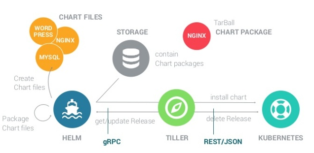

## Tìm hiểu về Helm

### Nội dung

	- Helm là gì?
	
	- Các chức năng của Helm
	
	- Khái niệm và kiến trúc
	
	- Cài đặt Helm
	
	- Tài liệu tham khảo
	

### 1. Helm là gì?

- Deploy một ứng dụng lên Kubernetes cluster - đặc biệt là các ứng dụng phức tạp - đòi hỏi việc tạo một loạt các resource của ứng dụng đó, ví dụ như Pod, Service, Deployment, ReplicaSet ... . Mỗi resource lại yêu cầu phải viết một file YAML chi tiết cho nó để deploy. Điều đó dẫn đến các thao tác CRUD(Create, Read, Update, Delete) trên một loạt các resource này trở nên phức tạp. Để giải quyết vấn đề này, Helm được ra đời.

- Như Ubuntu có apt, Centos có yum, tương tự Helm đóng vai trò là một Package Manager cho Kubernetes. Việc cài đặt các resource Kubernetes sẽ được thông qua và quản lý trên Helm. 

  
  
- Hiện tại, Helm là project chính thức của hệ sinh thái Kubernetes và được quản lý bởi Cloud Native Computing Foundation.

### 2. Các chức năng của Helm

- Helm cung cấp một số tính năng cơ bản mà một package manager cần phải có như sau:

	* Cài đặt các resource và tự động cài đặt các resource phụ thuộc.
    
	* Update và rollback các resource đã release.
    
	* Cấu hình.
    
	* Pull các package từ các repository
	
### 3. Khái niệm và kiến trúc

- Trước hết ta cần phải biết qua 3 concept chính của Helm:

    * Chart: là một cây thông tin cần cần thiết để mô tả một ứng dụng chạy trên Kubernetes cluster.
	
    * Config: chứa các thông tin cấu hình khi kết hợp với Chart tạo thành một đối tượng có thể release - phát hành hay cài đặt - trên Kubernetes.
	
    * Release: là một "running instance" của Chart kết hợp với Config.

- Các chức năng của Helm được thực hiện thông qua thành phần như sau:

  
  
- Helm Client: là một command-line client chịu trách nhiệm:

	* Tạo chart ở local.
    
	* Quản lý các repository.
    
	* Tương tác với Tilter server:
        
		- Gửi chart để cài đặt
        
		- Truy vấn thông tin của các release.
        
		- Gửi yêu cầu upgrade hay uninstall các release đã cài.

- Tilter server: là một server nằm trong Kubernetes cluster tương tác với Helm Client và là một interface đến các Kubernetes API. Server này chịu trách nhiệm cho việc:

	* Lắng nghe các request từ Helm Client.
    
	* Kết hợp Chart và Config để tạo nên một Release.
    
	* Cài đặt các Chart vào Kubernetes cluster, và theo dõi các Release tiếp theo.
    
	* Upgrade và Uninstall các Chart bằng các tương tác với Kubernetes cluster.
	
- Helm Charts: chart repository chính thức của Helm chứa hầu hết các chart được tạo sẵn dành cho các project open-source phổ biến. Repo: `https://github.com/helm/charts`
	
### 4. Cài đặt Helm

  ```
  wget https://get.helm.sh/helm-v2.14.2-linux-amd64.tar.gz
  tar -zxvf helm-v2.14.2-linux-amd64.tar.gz 
  cd linux-amd64/
  cp helm /usr/local/bin/
  ```
 

