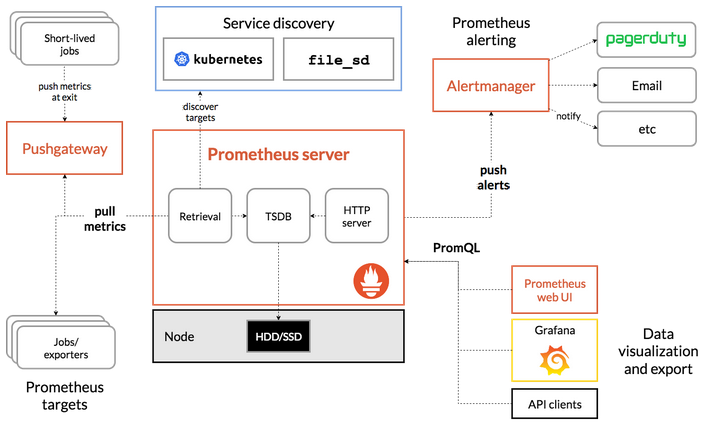
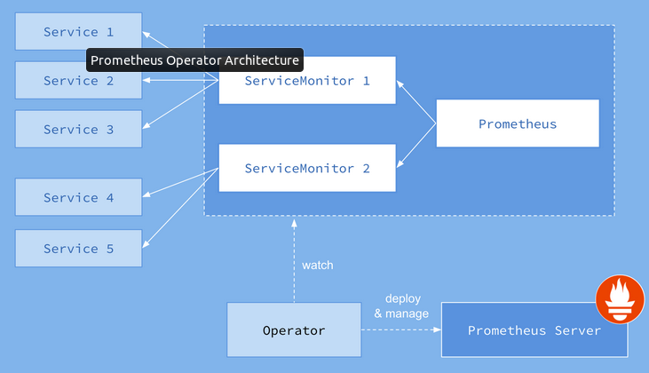
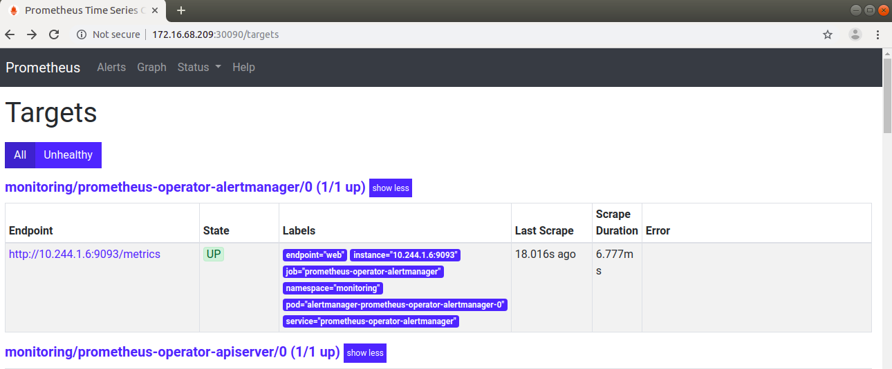
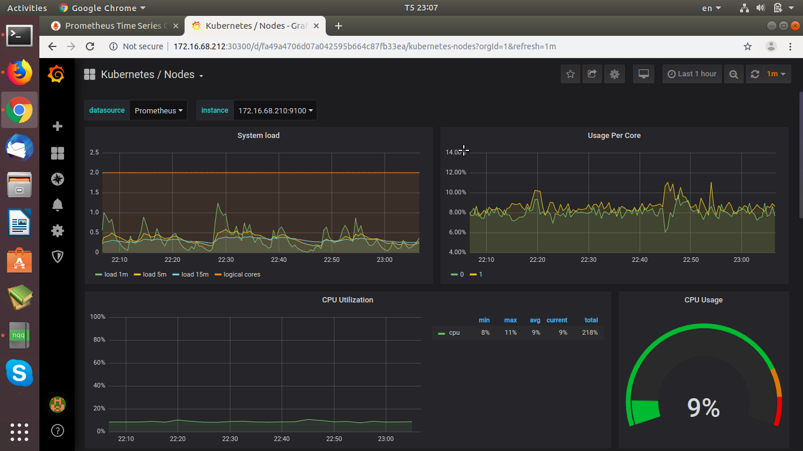

## Monitoring Kubernetes Cluster với Prometheus-Grafana 

### Nội dung

	1.Giới thiệu
	
	2.Prometheus
	
	3.Prometheus Operator
	
	4.Grafana
	
	5.Cài đặt
	
	6.Tài liệu tham khảo

### 1. Giới thiệu

- Trong phần này, mình sẽ giới thiệu đến các bạn bộ công cụ Prometheus - Grafana để monitoring cụm k8s.

- Thời gian gần đây thì Coreos đã cho ra mắt Prometheus-Operator giúp cho việc set up Prometeus và Grafana trên K8s trở nên dễ dàng hơn rất nhiều.

### 2. Prometheus

#### Khái niệm 

- Prometheus là một bộ công cụ giám sát và cảnh báo hệ thống mã nguồn mở ban đầu được xây dựng bởi công ty SoundCloud.

- Prometheus bây giờ đã trở thành một dự án mã nguồn mở độc lập. Prometheus đã tham gia vào tổ chức Cloud Native Computing Foundation vào năm 2016 với tư cách là dự án được ưu tiên phát triển thứ2 sau Kubernetes(k8s).

#### Một số tính năng của Prometheus

- Mô hình dữ liệu đa chiều - time series được xác định bởi tên của số liệu (metric) và cặp key-value.
    
- Ngôn ngữ truy vấn linh hoạt.
    
- Hỗ trợ nhiều biểu đồ.
 
- Dễ dàng cấu hình cảnh báo
    
- Chỉ cần 1 máy chủ là có thể hoạt động được.
   
- Hỗ trợ Push các time-series thông quan 1 gateway trung gian.
    
- Prometheus sử dụng Alertmanager để lấy và gửi cảnh báo đi.
    
- Prometheus cung cấp giao diện đơn giản đề tạo truy vấn và hiển thị biểu đồ.
    
- Kết hợp với Grafana để hiện thị dữ liệu dưới dạng nhiều kiểu biểu đồ khác nhau.

#### Kiến trúc Prometheus

 

- Cách hoạt động:

	- Các jobs được phân chia thành short-lived và long-lived jobs/Exporter.

	- Short-lived là những job sẽ tồn tại trong thời gian ngắn và prometheus-server sẽ không kịp scrapes metrics của các jobs này. Do đó, những short-lived jobs sẽ push (đẩy) các metrics đến một nơi gọi là Pushgateway. Pushgateway sẽ là nơi sẽ phơi bày metrics ra và prometheus-server sẽ lấy được metrics của short-lived thông qua Pushgateway.

	- Long-lived jobs/Exporter: Là những job sẽ tồn tại lâu dài. Các Exporter sẽ được chạy như dưới dạng 1 service. Exporter có nhiệm vụ thu thập metrics và phơi bày metrics đấy ra.

	- Prometheus-server scrapes metrics từ các jobs, Pushgateway, service discovery thông qua hành động pull. Sau đó, nó sẽ lưu trữ các metrics này vào Database. Dựa vào các rules mà ta quy định, (ví dụ như khi cpu xử lý hơn 80%) thì prometheus-server sẽ push (đẩy) cảnh báo đến thành phần Alertmanager.

	- PromDash, Grafana,.. dùng câu lệnh querying (PromQL - Prometheus Query Language) để lấy được thông tin metrics lưu trữ ở Prometheus-server và hiển thị thành các dạng biểu đồ.
	
	- Alertmanager sẽ được cấu hình các thông tin cần thiết để có thể gửi cảnh bảo đến email, slack,.... Sau khi prometheus-server push alerts đến alertmanager, alertmanager sẽ gửi cảnh báo đến người dùng.
	
### 3. Prometheus Operator

- Prometheus Operator được phát triển bởi CoreOs cung cấp việc monitoring K8s service và deployment một cách dễ dàng bên cạnh việc quản lý các cấu hình của Prometheus, Alertmanager và Grafana.

- Mô hình hoạt động của Prometheus Operator:

  
  
- service monitors thực hiện scrape metrics các thành phần của kubernetes:
	
	* kube-apiserver
    * kube-scheduler
    * kube-controller-manager
    * etcd
    * kube-dns/coredns
    * kube-proxy

### 4. Grafana

- Cơ bản thì Grafana là một dashboard app cho phép ta tạo các dashboard từ các nguồn dữ liệu time-series.

### 5. Cài đặt

#### Yêu cầu:
	
	* Kubernetes cluster đang chạy
	
	* Helm đã được cài đặt 

#### Cài đặt:

- Tạo file rbac-config.yaml

  ```
  apiVersion: v1
  kind: ServiceAccount
  metadata:
    name: tiller
    namespace: kube-system
  ---
  apiVersion: rbac.authorization.k8s.io/v1
  kind: ClusterRoleBinding
  metadata:
    name: tiller
  roleRef:
    apiGroup: rbac.authorization.k8s.io
    kind: ClusterRole
    name: cluster-admin
  subjects:
    - kind: ServiceAccount
      name: tiller
      namespace: kube-system
  ```

- Apply file rbac-config.yaml
  
  ```
  kubectl apply -f rbac-config.yaml
  ```

- Khởi tạo server tiller (Helm)

  ```
  helm init --service-account tiller
  ```

- Update repo Helm

  ```
  helm repo update
  ```

- Install prometheus-operator với helm

  ```
  helm install stable/prometheus-operator --name prometheus-operator --namespace monitoring
  ```

- Kiểm tra việc cài đặt:
  
  ```
  root@master-1:~# kubectl get pod -n monitoring
  NAME                                                      READY   STATUS    RESTARTS   AGE
  alertmanager-prometheus-operator-alertmanager-0           2/2     Running   0          36h
  prometheus-operator-grafana-59c4fc9b89-zmh4m              2/2     Running   0          36h
  prometheus-operator-kube-state-metrics-59fb8495c9-xjgls   1/1     Running   0          36h
  prometheus-operator-operator-74fdc74b8d-kbpl2             1/1     Running   0          36h
  prometheus-operator-prometheus-node-exporter-g6b6j        1/1     Running   0          36h
  prometheus-operator-prometheus-node-exporter-hshnf        1/1     Running   0          36h
  prometheus-operator-prometheus-node-exporter-pv289        1/1     Running   0          36h
  prometheus-prometheus-operator-prometheus-0               3/3     Running   1          36h
  ```
  
- Run Prometheus dashboard: Để khởi chạy Prometheus dashboard chúng ta sẽ tạo 1 service type NodePort. Tạo service
  
  ```
  # create file prom-service.yml
  apiVersion: v1
  kind: Service
  metadata:
    name: prom-service
    labels:
      app: prometheus
  spec:
    type: NodePort
    ports:
      - port: 9090
        nodePort: 30090
    selector:
      app: prometheus
  
  # run service
  $ kubectl apply -f prom-service.yml -n monitoring
  service "prom-service" created
  ```
  
- Truy cập http://{operator-prometheus IP}:30090/targets

  
  
- Run Grafana dashboard. Tạo service:

  ```
  # create file grafana-service.yml
  apiVersion: v1
  kind: Service
  metadata:
    name: grafana-service
    labels:
      app: grafana
  spec:
    type: NodePort
    ports:
      - port: 3000
        nodePort: 30300
    selector:
      app: grafana
 
  # run service
  $ kubectl apply -f grafana-service.yml -n monitoring
  service "grafana-service" created
  ```
  
- Config password admin grafana dashboard:

  ```
  kubectl exec -it -n monitoring prometheus-operator-grafana-697d578598-b5nm6 -c grafana /bin/bash
  grafana-cli admin reset-admin-password "ahihi"
  ```
- Truy cập http://{grafana IP}:30300/

  
  
### 6. Tài liệu tham khảo

- https://prometheus.io/

- https://github.com/hocchudong/ghichep-prometheus

- https://coreos.com/operators/prometheus/docs/latest/user-guides/getting-started.html

- https://github.com/helm/charts/tree/master/stable/prometheus-operator