## 1. Giới thiệu:

- Một trong những phần phức tạp và quan trọng nhất khi tìm hiểu về k8s là phần Network. Trong phần này, tôi sẽ giới thiệu về network của 1 pod, cách thức kết nối giữa các pods trong 1 cụm cluster k8s.

## 2. Network on Pod

- Về cốt lõi, Network trong k8s có 1 triết lí thiết kế cơ bản quan trọng là: **Mỗi Pod có 1 IP**.

- IP của 1 pod được chia sẻ bởi tất cả các container trong Pod này, và mặc định nó có thể kết nối từ tất cả các Pod khác trong 1 cụm k8s. 

- Bạn có bao giờ để ý thấy 1 số container `pause` đang chạy trên tất cả các node trong k8s? 
  
  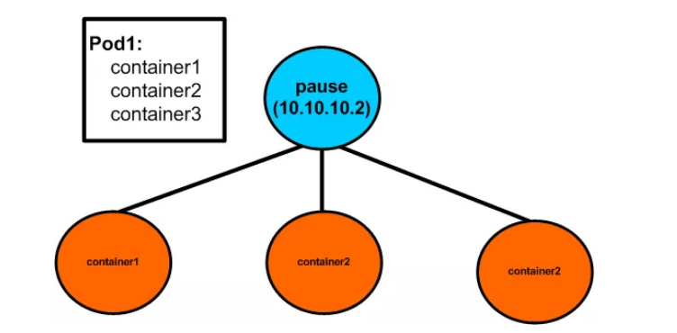

- Chúng được gọi là các `sandbox containers`, có 1 nhiệm vụ duy nhất là lưu giữ `network namespace` (netns) được chia sẻ bởi tất cả các container trong 1 pod. Với cơ chế này, trong 1 Pod khi 1 container chết hoặc 1 container mới được tạo thì IP Pod sẽ không bị thay đổi.

## 3. Network Pod to Pod  

- Trong k8s, để kết nối giữa các pods, ta cần sử dụng 1 network plugin ngoài như Flannel, Calico, Cannal, Weave... Ở trong bài này, mình sẽ nói về sử dụng `Flannel` và `Calico` để kết nối giữa các pods trong k8s.

## 3.1. Flannel

### Khái niệm: 

- Flannel là một giải pháp overlay network được sử dụng để cấu hình network trong k8s. Về cơ bản, cơ chế overlay networks sẽ sử dụng backend (VXLAN, GRE...) để đóng gói `packet-in-packet` đi qua underlay networks (hạ tầng mạng vật lí cơ bản). Ở đây, Flannel sử dụng backend VXLAN.

- Flannel chạy 1 tiến trình agent có tên là flanneld trên tất cả các node trong cụm k8s. Tiến trình này chịu trách nhiệm phân bổ `subnet lease` trên mỗi node.

- Flannel sử dụng Kubernetes API hoặc gọi trực tiếp vào etcd để lưu trữ cấu hình mạng, subnet được phân bổ như nào và bất kì dữ liệu phụ trợ nào khác ( như IP public của host). 

### Kết nối giữa các Pod trên 1 node

 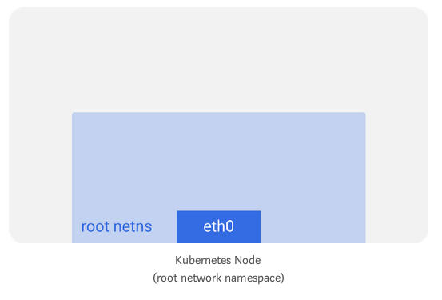
 
- Trên mỗi node trong cụm k8s (chạy hệ điều hành linux) sẽ có 1 `root network namespace` ( root netns). Interface chính `eth0` nằm trong `root network namespace` này.

- Tương tự, mỗi pod sẽ có netns riêng, với 1 virtual ethernet (veth) kết nối nó tới `root netns`. Về cơ bản, `veth` là 1 đường ống với 2 đầu, 1 đầu được gắn với root netns và đầu còn lại gắn với pod netns.

  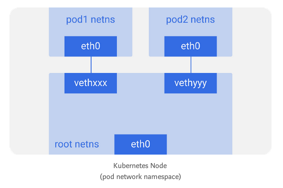  

- Bạn có thể liệt kê tất cả các network interface trên node với lệnh `ifconfig` hoặc `ip a`.

- Trong k8s, sẽ sử dụng 1 bridge `cbr0` để các pod trên 1 node nói chuyện với nhau.

  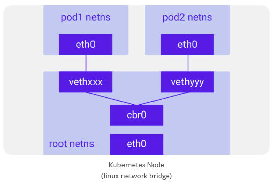
  
- Bạn có thể list các bridge bằng lệnh `brctl show`.

- Traffic flows:
  
  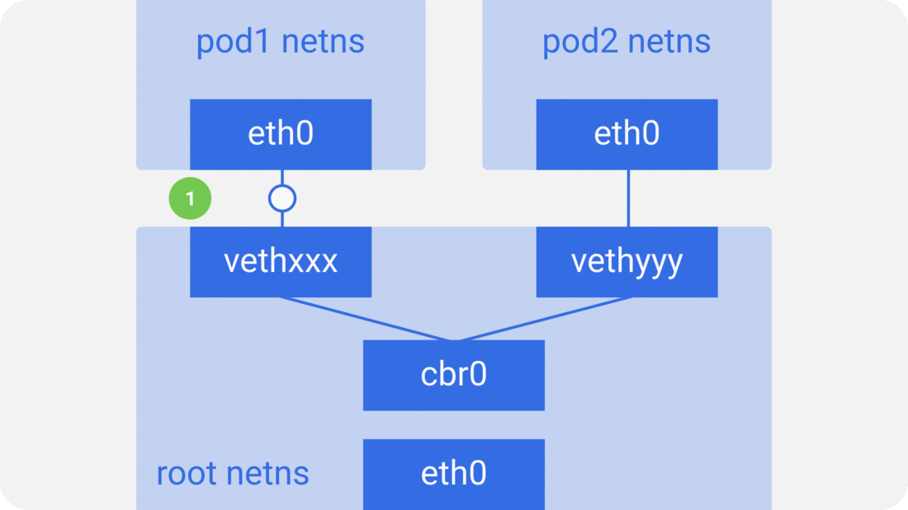

	* 1.Gói tin từ pod1 đi vào root netns tại `vethxx`.
  
	* 2.Gói tin được chuyển tới bridge `cbr0`, để phát hiện ra đích đến của gói tin bằng cách sử dụng `ARP request`, nói rằng pod nào có IP này? 
  
	* 3.`vethyyy` nói rằng nó có IP đó, vì vậy bridge `cbr0` sẽ biết nơi chuyển tiếp gói tin.
  
	* 4.Gói tin được gửi đến `vethyyy`, và gửi đến pod2.
  
### Kết nối giữa các pod trên các node khác nhau

- Như đề cập ở trên, các pod cũng cần kết nối được trên tất cả các node trong 1 cụm k8s. Để làm được điều này, có thể sử dụng L2 (ARP across nodes), L3 (IP routing giữa các node) hoặc overlay networks. Một số plugins network được sử dụng trong k8s: flannel, calico, weave, cannal...

- Mỗi node trong cụm k8s sẽ được gán 1 `CIDR block` (1 dải địa chỉ IP) để cấp cho các pods, vì vậy mỗi pod có 1 IP duy nhất và không bị conflict với các pods trên 1 node khác trong cụm k8s.

- Phần tiếp theo, mình sẽ nói về một số kiểu network được sử dụng trong k8s: `flannel`, `calico`

### Traffic flows

- Traffic flows trong `flannel` sử dụng backend `VXLAN`:

  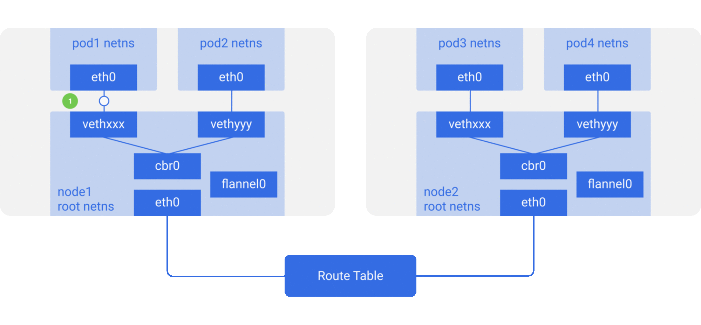

- Luồng gói tin gửi từ pod1 đến pod4 (trên node khác):
 
	* 1.Gói tin từ `pod1` netns tại `eth0` trên pod 1 được gửi vào root netns tại `vethxxx`.
  
  	* 2.Gói tin chuyển tới `cbr0`, và gửi yêu cầu ARP để tìm destination của gói tin.
  
  	* 3a.Vì không pod nào trên node này có địa chỉ IP cho `pod4`, nên bridge `cbr0` gửi nó tới `flannel0`. Vì bảng định tuyến của node được cấu hình với `flannel0` làm mục tiêu cho range IP pod. Các thông tin cấu hình này được lưu ở `etcd`.
  
  	* 3b.Khi tiến trình `flanneld` daemon nói chuyện với `kubernetes apiserver` hoặc `etcd`, nó sẽ biết về tất cả các IP của pod và các dải IP của pod đang nằm trên node nào. Vì vậy, `flannel` sẽ ánh xạ các IP pod với IP của các node. `flannel0` lấy gói tin này và đóng gói vào trong gói UDP với các header bổ sung thay đổi IP nguồn và IP đích đến các node tương ứng và gửi nó đến 1 port đặc biệt `vxlan` (thường là 8472).
  
    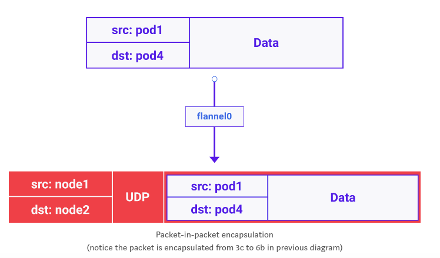
	
	* 3c.Gói tin này được đóng gói và gửi qua eth0.
	
	* 4.Gói tin rời khỏi node với sourceIP là IP node1 và destIP là IP node2.
	
	* 5.Bảng định tuyến của mạng vật lí đã biết cách định tuyến giữa các node, do đó nó gửi gói tin đến node2.
	
	* 6a.Gói tin này đến `eth0` của node2. Do port là port đặc biệt `vxlan`, kernel sẽ gửi gói tin đến `flannel0`.
	
	* 6b.`flannel0` sẽ thực hiện de-capsulates và gửi nó vào trong root netns.
	
	* 6c.`Vì IP forwarding được enabled`, kernel sẽ chuyển tiếp gói tin tới `cbr0`.
	
	* 7.Bridge `cbr0` sẽ lấy gói tin và thực hiện 1 request ARP và phát hiện ra răng IP này thuộc về `vethyyy`.
	
	* 8.Gói tin sẽ đi qua `vethyyy` và được gửi tới pod4.

- Một số lưu ý khi sử dụng Flannel:
	
	* Flannel sử dụng công nghệ `vxlan`: không có mã hóa giữa các node.
	
	* Flannel không hỗ trợ NetworkPolicy trong k8s.

## 3.2. Calico

### Khái niệm:

- Calico là network opensource và là 1 giải pháp bảo mật mạng cho các container, virtual machines và native host-based workloads. Calico hỗ trợ một loạt các nền tảng khác nhau bao gồm: Kubernetes, OpenShift, DockerEE, OpenStack và bare metal services.

- Calico hỗ trợ Full Kubernetes network policy.

### Kiến trúc, các thành phần:

  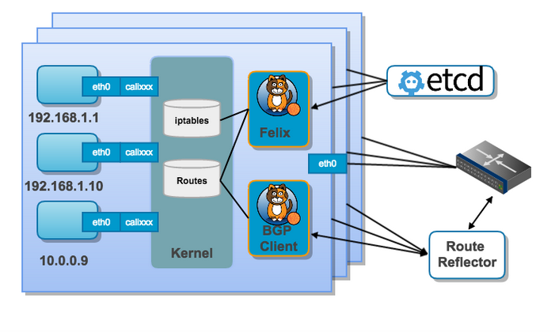

- Calico được tạo thành từ các thành phần sau:

	* Felix
	
	* Orchestrator plugin
	
	* Etcd

	* BIRD (BGP client)
	
	* BGP Route Relector
	
#### Felix:

- Felix là 1 daemon, chạy trên tất cả các node trong cụm k8s. Felix chịu trách nhiệm: **Interface management, Route programming, ACL programming, State reporting.**

	- **Interface management**: 

	- **Route programming**: Felix có chức năng tạo ra các routes trên mỗi node trong cụm k8s. Điều này sẽ đảm bảo định tuyến được đúng đường đi giữa các pods trong 1 cụm k8s.

	- **ACL programming**: Felix cũng chịu trách nhiệm tạo ra các ACL (Access list control). Các ACL này được sử dụng để đảm bảo rằng chỉ có thể gửi các traffic hợp lệ giữa các endpoints và đảm bảo rằng các endpoints này không có khả năng phá vỡ các biện pháp bảo mật của `Calico`.

	- **State reporting**: Felix cung cấp dữ liệu về tình trạng của mạng. Cụ thể, nó sẽ report các lỗi và vấn đề về mạng. Dữ liệu này được ghi vào `etcd`.

#### Orchestrator plugin:

- Với mỗi 1 nền tảng điều phối riêng (ví dụ: Openstack, Kubernetes), sẽ có plugin riêng. Mục đích của plugin này là liên kết chặt chẽ giữa `Calico` với bộ điều phối, cho phép người dùng quản lí mạng `Calico` giống như họ đang quản lí các công cụ mạng được tích hợp sẵn trong bộ điều phối. Với mỗi 1 orchestation sẽ có 1 bộ API riêng.

#### Etcd:

- Thành phần được sử dụng để lưu trữ dữ liệu của `Calico`.

#### BGP client (BIRD):

- Giống như `Felix`, Calico triển khai `BGP client` trên tất cả các node trong cụm k8s. Vai trò của `BIRD` là đọc các trạng thái định tuyến từ `Felix` và phân phối nó tới trung tâm dữ liệu.

- Khi `Felix` thực hiện insert các routes vào FIB của kernel Linux, `BIRD` sẽ chọn chúng và phân phối chúng đến các node khác trong cụm k8s. Điều này đảm bảo rằng traffic được định tuyến 1 cách hiệu quả, chính xác giữa các node trong cụm k8s.

#### BGP route reflector (BIRD):

- Đối với các mô hình triển khai k8s lớn, BGP đơn giản có thể trở thành 1 yếu tố hạn chế vì nó yêu cầu mọi BGP client phải được kết nối với mọi BGP client khác trong mạng mesh topology.

  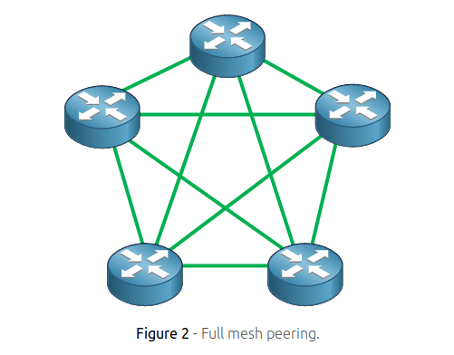
  
- Điều này đòi hỏi số lượng kết nối ngày càng tăng nhanh chóng trở nên khó khăn để duy trì. Vì lí do này, trong các mô hình triển khai lớn, Calico sẽ triển khai `BGP route reflector`. Thành phần này, thường được sử dụng trong Internet, hoạt động như 1 điểm trung tâm mà các BGP client kết nối đến, ngăn các BGP client không cần phải nói chuyện trực tiếp với các BGP client khác trong cụm.

  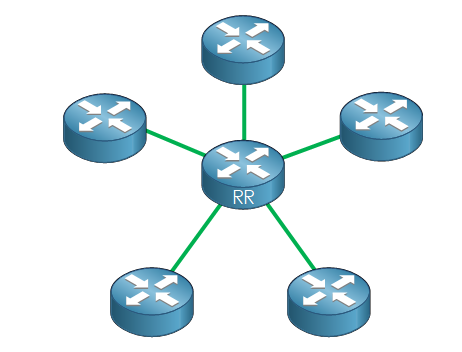
  
- BGP route reflector có nhiệm vụ **phân phối tuyến đường tập trung**:

  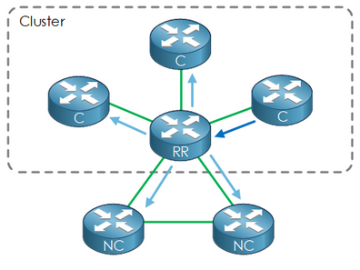
  
- Khi `BGP client` quảng cáo các tuyến đường từ FIB của nó đến `BGP route reflector`, `BGP route reflector` sẽ quảnq cáo các tuyến đó ra các node khác trong quá trình triển khai.

#### Cơ chế kết nối giữa các pods:

- Calico hỗ trợ đóng gói (encapsulation) để có thể gửi traffic giữa các pods mà không yêu cầu hạ tầng mạng bên dưới phải biết về địa chỉ IP của các pods.

- Calico hỗ trợ 2 loại đóng gói: `VXLAN` và `IP-in-IP`. VXLAN được hỗ trợ trong 1 số môi trường không có `IP in IP` (ví dụ: Azure). Tuy nhiên, VXLAN có hạn chế hơn chút về mặt hiệu năng, bởi vì gói tin `VXLAN` có header lớn hơn so với `IP in IP`. Sau đây mình sẽ giải thích rõ hơn về điều này:

- `MTU` là 1 thuộc tính global của path network giữa các endpoints, nên MTU workloads cần được đặt thành MTU tối thiểu của bất kỳ path network nào mà gói tin có thể đi qua.

- Nếu bạn đang sử dụng overlays như `IP-in-IP` hoặc `VXLAN`, overlay header bổ sung được sử dụng bởi các giao thức đó sẽ giảm MTU tối thiểu theo kích thước của header. `IP-in-IP` sử dụng header 20 byte, VXLAN sử dụng header 50 byte. Vì thế:
	
	* Nếu sử dụng `VXLAN` ở bất cứ đâu trong pod network, bạn nên chọn 1 MTU là MTU mạng trừ 50.
		
	* Nếu sử dụng `IP-in-IP`, bạn nên chọn 1 MTU là MTU mạng trừ 20.
		
- Bảng kích thước MTU phổ biến:

  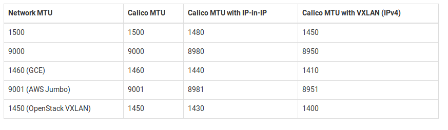
  
- MTU mặc định cho workload interfaces là 1500, đây là để phù hợp với kích thước MTU mạng phổ biến nhất. MTU mặc định cho `IP-in-IP` tunnel là 1440 để phù hợp với giá trị cần thiết trong GCE. Tương tự, mặc định cho VXLAN là 1410.

#### Mô hình kết nối:
  
  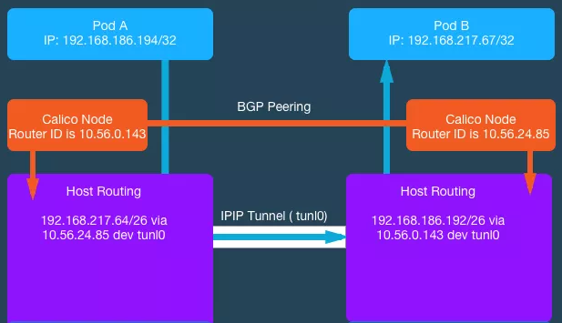
  
- 

	* Configure IP in IP encapsulation for only cross subnet traffic
	
    * Configure IP in IP encapsulation for all inter workload traffic
	
    * Configure VXLAN encapsulation for all inter workload traffic

#### Configure IP in IP encapsulation for only cross subnet traffic

  ```
  apiVersion: projectcalico.org/v3
  kind: IPPool
  metadata:
    name: ippool-cross-subnet-1
  spec:
    cidr: 192.168.0.0/16
    ipipMode: CrossSubnet
    natOutgoing: true
  ```

##### Configure IP in IP encapsulation for all inter workload traffic

- Đây là cấu hình mặc định khi sử dụng `Calico`

  ```
  apiVersion: projectcalico.org/v3
  kind: IPPool
  metadata:
    name: ippool-ipip-1
  spec:
    cidr: 192.168.0.0/16
    ipipMode: Always
    natOutgoing: true
  ```
- 

### NetworkPolicy trong k8s

- Mặc định trong 1 cụm k8s, tất cả các Pod sẽ nói chuyện được với nhau. Để tăng tính bảo mật cho các ứng dụng, trong k8s sử dụng resource `NetworkPolicy`.

- `NetworkPolicy` cho phép bảo mật các ứng dụng bằng cách cung cấp các Policy để kiểm soát các kết nối vào/ra giữa các pods trong k8s. Tuy nhiên, bản thân k8s không có khả năng thực thi các network policy này. Để thực thi các network policy, ta cần phải sử dụng 1 network plugin có khả năng thực thi các network policy này (Calico, Cannal).

- Trước khi cấu hình NetworkPolicy:

  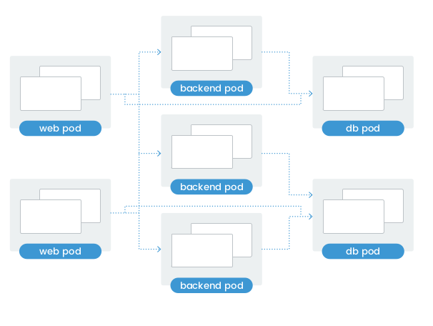

- Sau khi cấu hình NetworkPolicy:
  
  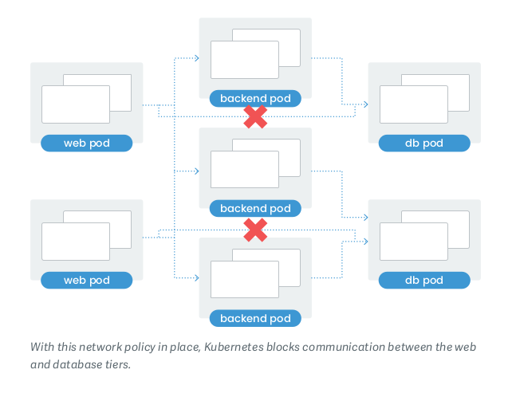

- **Ví dụ về NetworkPolicy:

- Các pod:
  
  ```
  kubectl get pod -o wide
  NAME                        READY   STATUS    RESTARTS   AGE     IP               NODE      NOMINATED NODE   READINESS GATES
  backend-6db5cdbb4b-b9tdm    1/1     Running   0          2m36s   192.168.189.77   worker2   <none>           <none>
  db-5b54c87fdb-v6rl2         1/1     Running   0          3m36s   192.168.189.75   worker2   <none>           <none>
  frontend-5575ff85dd-76frq   1/1     Running   0          2m42s   192.168.189.76   worker2   <none>           <none>
  frontend-5575ff85dd-gz467   1/1     Running   0          2m42s   192.168.182.8    worker3   <none>           <none>
  frontend-5575ff85dd-hd9rf   1/1     Running   0          2m42s   192.168.182.7    worker3   <none>           <none>
  ```
  
- Trước khi cấu hình Networkpolicy, các pod web(frontend) sẽ nói chuyện được với các db pod. Thực hiện trên pod `frontend-5575ff85dd-76frq` ping đến pod `db-5b54c87fdb-v6rl2`:
  
  ```
  root@frontend-5575ff85dd-76frq:/# ping 192.168.189.75 -c 2
  PING 192.168.189.75 (192.168.189.75) 56(84) bytes of data.
  64 bytes from 192.168.189.75: icmp_seq=1 ttl=63 time=0.156 ms
  64 bytes from 192.168.189.75: icmp_seq=2 ttl=63 time=0.129 ms
  ```
  
- Cấu hình 1 NetworkPolicy chỉ cho phép các pod backend kết nối đến pod database, các pod web(frontend) sẽ không được phép kết nối tới các pod db.

  ```
  vim networkpolicy.yaml
  
  kind: NetworkPolicy
  apiVersion: networking.k8s.io/v1
  metadata:
    name: db-access-ingress
  spec:
    podSelector:
      matchLabels:
        role: db
  ingress:
    - from:
      - podSelector:
          matchLabels:
            role: backend
  ```

- *NetworkPolicy trên chỉ ra rằng sẽ chỉ cho phép các kết nối từ các pods có label là `role:backend` vào các pods có label là `role:db`.

- Apply networkPolicy: 

  ```
  kubectl apply -f networkpolicy.yaml
  networkpolicy.networking.k8s.io/backend-access-ingress created
  networkpolicy.networking.k8s.io/db-access-ingress created

- Sau khi config NetworkPolicy trên, ta thực hiện test, vẫn ở trên pod `frontend-5575ff85dd-76frq` ping đến pod `db-5b54c87fdb-v6rl2`:

  ```
  root@frontend-5575ff85dd-76frq:/# ping 192.168.189.75 -c 2 -t 3
  PING 192.168.189.75 (192.168.189.75) 56(84) bytes of data.
  --- 192.168.189.75 ping statistics ---
  2 packets transmitted, 0 received, 100% packet loss, time 1014ms
  ```
  
  


