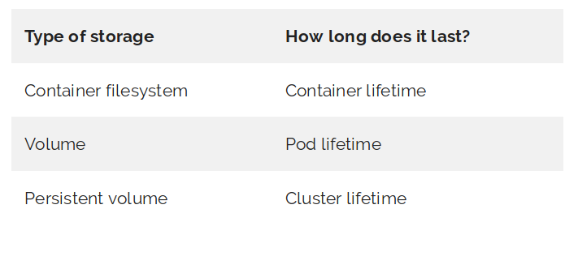
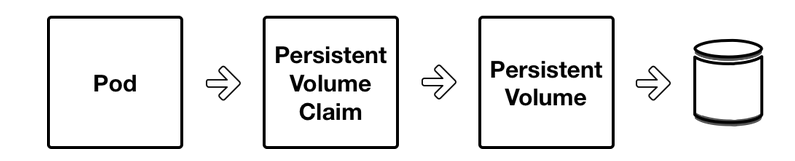

### 1. Giới thiệu

  

- Trong k8s, 1 pod có thể gồm nhiều container, để đảm bảo dữ liệu của các container trong 1 pod không bị mất khi 1 container nào đó bị restart, k8s sử dụng `volume`. Các container trong 1 pod sẽ sử dụng chung volume. 

- Volume là 1 thành phần của Pod, nó độc lập với các container trong pod **( không độc lập với pod )**.

- Một Kubernetes Volume tồn tại độc lập với bất kỳ container nào, nhưng khi Pod kèm theo mà restart thì Volume cũng sẽ mất.

- Để giải quyết vấn đề này, k8s sử dụng `persistent volumes` (PV).

- `Persistent volumes` là kiểu lưu trữ dữ liệu bền bỉ trong cụm k8s cluster, nó tồn tại độc lập với vòng đời của containers, pods và có thể là cả các node trong cụm cluster.

- 1 pod sẽ không access trực tiếp vào `persistent volumes` mà nó sử dụng `persistent volume claim` (PVC) để đọc và ghi dữ liệu tới `persistent volume`.

  
  
- Trên thực tế, Pod sẽ chỉ biết về PVC mà không quan tâm tới PV. PVC sẽ tiêu thụ tài nguyên PV, tương tự như cách Pod tiêu thụ tài nguyên Node (cpu,ram).

- Các bước cần thực hiện để triển khai các pod sử dụng persistent volumes.

    * Khởi tạo 1 Persistent Volume. PV có thể là 1 trong các kiểu nfs, glusterfs, ceph, gcePersistentDisk, awsElasticBlockStore...
	
    * Một người dùng Cluster cá nhân cần lưu trữ cho Pod tạo ra một manifest Persistent Volume Claim (PVC). Nó chỉ định dung lượng lưu trữ và kiểu lưu trữ họ cần. PVC sẽ thực hiện bound với PV được tạo ở trên. 
	
	* Sau đó, người dùng tạo Pod với volume sử dụng PVC.

- Để hiểu rõ hơn, sau đây mình sẽ thực hiện bài lab sử dụng nfs (network file system) để làm persistent volumes cho các pod trong cụm cluster k8s.

### 2. Lab

#### Mô hình:

- Cụm cluster k8s: 172.16.68.210, 172.16.68.211, 172.16.68.212

- NFS server: 172.16.68.214 

#### Triển khai:

- Yêu cầu đã cài đặt, cấu hình cụm k8s 

- Yêu cầu đã cài đặt nfs-server và thực hiện share thư mục `/data/k8s/test` trên server 172.16.68.214. Lưu ý: cài gói nfs-common trên các worker node trong cụm cluster k8s.


- B1: Tạo 1 file định nghĩa persistent volume:

  ```
  cat pv-nfs.yaml
  
  apiVersion: v1
  kind: PersistentVolume
  metadata:
    name: my-nfs-share
    labels:
      storage: test1
  spec:
    storageClassName: test
    capacity:
      storage: 5Gi # This size is used to match a volume to a tenents claim
    accessModes:
      - ReadWriteMany # Access modes are defined below
    persistentVolumeReclaimPolicy: Recycle # Reclaim policies are defined below 
    nfs:
      server: 172.16.68.214
      path: "/data/k8s/test"
  ```
  
- B2: Tạo Persistent volume:

  ```
  kubectl apply -f pv-nfs.yaml
 
  kubectl get pv
  NAME           CAPACITY   ACCESS MODES   RECLAIM POLICY   STATUS   CLAIM               STORAGECLASS   REASON   AGE
  my-nfs-share   5Gi        RWX            Recycle          Bound    default/myapp-nfs   test                    22h
  ```

- B3: Tạo file định nghĩa persistent volume claim:

  ```
  cat pv-nfs-claim.yaml
  
  apiVersion: v1
  kind: PersistentVolumeClaim
  metadata:
    name: myapp-nfs
    namespace: default
  spec:
    storageClassName: test
    accessModes:
      - ReadWriteMany # Access modes for volumes is defined under Persistent Volumes
    resources:
      requests:
        storage: 5Gi # volume size requested
    selector:
      matchLabels:
        storage: test1
  ```
  
- B4: Tạo persistent volume claim

  ```
  kubectl apply -f pv-nfs-claim.yaml
  
  kubectl get pvc
  NAME        STATUS   VOLUME         CAPACITY   ACCESS MODES   STORAGECLASS   AGE
  myapp-nfs   Bound    my-nfs-share   5Gi        RWX            test           22h
  ```

- B5: Tạo file deployment sử dụng pvc vừa tạo ở trên:

  ```
  cat deployment-pvc.yaml 
  
  apiVersion: apps/v1 # for versions before 1.9.0 use apps/v1beta2
  kind: Deployment
  metadata:
    name: nginx
  spec:
    selector:
      matchLabels:
        app: nginx
    replicas: 3
    template: # create pods using pod definition in this template
      metadata:
        labels:
          app: nginx
    spec:
      containers:
      - image: nginx
        name: test-web
        volumeMounts:
        - mountPath: /var/www/html
          name: data  
      volumes:
      - name: data
        persistentVolumeClaim:
          claimName: myapp-nfs
  ```
- Deploy deployment:

  ```
  kubectl apply -f deployment-pvc.yaml
  
  kubectl get pod -o wide
  NAME                     READY   STATUS    RESTARTS   AGE     IP            NODE       NOMINATED NODE   READINESS GATES
  nginx-75dfcbb9ff-2xxjf   1/1     Running   0          3m35s   10.244.2.14   master-3   <none>           <none>
  nginx-75dfcbb9ff-5gcf7   1/1     Running   0          22h     10.244.1.12   master-2   <none>           <none>
  nginx-75dfcbb9ff-msjsb   1/1     Running   0          22h     10.244.0.23   master-1   <none>           <none>
  ```
  
### Check kết quả: 

- Tạo thử 1 file test.txt trên pod `nginx-75dfcbb9ff-2xxjf`:

  ```
  kubectl exec -it nginx-75dfcbb9ff-2xxjf /bin/bash
  touch /var/www/html/test.txt  
  exit
  ```

- Kiểm tra file test.txt trên pod `nginx-75dfcbb9ff-5gcf7`:

  ```
  kubectl exec -it nginx-75dfcbb9ff-5gcf7 /bin/bash
  root@nginx-75dfcbb9ff-5gcf7:/# ls /var/www/html/
  test.txt
  ```

- Truy cập vào nfs-server 172.16.68.214, ta thấy file test.txt được lưu trên thư mục share: /data/k8s/test ở trên.

